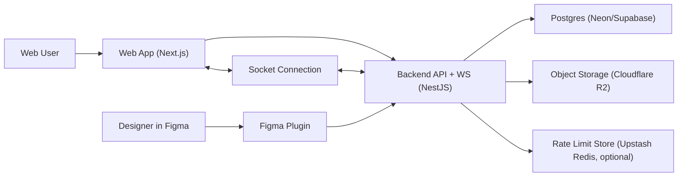

# DesignFlow End-to-End Architecture (Free-First)

Version: v1.0  
Date: 2026-02-21  
Status: Implementation-ready design

## 1) Purpose

This document turns the locked MVP decisions into a full implementation architecture, optimized to keep infrastructure cost as close to $0 as possible while preserving a path to production scaling.

It is aligned with:

- `/Users/shrutigitte/Desktop/SOS/backend/docs/designflow/mvp-decisions.md`
- `/Users/shrutigitte/Desktop/SOS/backend/docs/designflow/rbac-policy.md`
- `/Users/shrutigitte/Desktop/SOS/backend/docs/designflow/websocket-contract.md`
- `/Users/shrutigitte/Desktop/SOS/backend/docs/designflow/openapi/designflow-mvp.yaml`
- `/Users/shrutigitte/Desktop/SOS/backend/prisma/schema.prisma`

## 2) MVP Scope (Locked)

In scope:

- Org + project multi-tenancy.
- Project-level RBAC.
- Figma plugin issue creation from selected node.
- Thumbnail upload via signed URL + completion verification.
- Kanban board with optimistic concurrency.
- Issue chat + project chat.
- Activity log (append-only).
- WebSocket real-time updates for web clients.

Out of scope:

- Sprints.
- DM chat.
- automation rules.
- advanced search/JQL.
- enterprise SSO.

## 3) Free-First Service Strategy

### 3.1 Primary stack (recommended)

- Web app hosting: `Vercel Hobby` (free).
- API + WebSocket backend hosting: single Node server on a free/low-cost host you control.
  - Dev and pre-MVP production can run on one process to avoid extra infra.
- Postgres: `Neon Free` (or `Supabase Free` fallback).
- Thumbnail object storage: `Cloudflare R2` free tier first.
- Rate limiting + optional cache/pubsub: `Upstash Redis Free`.
- CI: `GitHub Actions` free quotas.

### 3.2 Why this is cost-efficient

- Postgres is external managed free tier (no DB ops burden).
- Object storage is cheap with free monthly allowance and zero egress fee on R2.
- Frontend on free hobby hosting.
- Optional Redis starts free and only needed for stronger rate limiting and future horizontal scale.
- Backend starts as one service (API + WS) to reduce operational overhead.

### 3.3 When paid cost likely begins

- You exceed Neon/Supabase free DB usage.
- Thumbnail storage or operation volume exceeds R2 free tier.
- You need high-availability WS horizontally (introduce Redis adapter and multiple backend instances).
- Commercial usage constraints of hobby plans require upgrade.

## 4) System Architecture



Key rules:

- Plugin never talks directly to DB.
- Plugin never directly sets issue thumbnail URL.
- WebSocket joins are authorized against DB-backed membership checks.
- All writes pass RBAC + validation + audit logging.

## 5) Logical Modules

## 5.1 Auth Module

- Web auth via NextAuth/Auth.js with Google OAuth.
- Session strategy: database session (aligned with MVP decision) for simplicity and revocation control.
- PAT auth for plugin endpoints only.

## 5.2 Org/Project Membership Module

- Handles org membership + project membership.
- Exposes permission-check helpers:
  - `requireOrgRole(minRole)`
  - `requireProjectRole(minRole)`
  - `requireIssueAccess()`

## 5.3 Issues Module

- CRUD and status transitions.
- Kanban move endpoint with optimistic lock:
  - Requires `expectedVersion`.
  - Returns `409 VERSION_CONFLICT` with current issue snapshot on mismatch.

## 5.4 Plugin Module

- PAT verification.
- Project listing.
- Idempotent issue creation with `Idempotency-Key`.
- Thumbnail completion endpoint with server-side HEAD validation.

## 5.5 Messaging Module

- Project chat and issue chat.
- `PROJECT_VIEWER` has read-only access.
- `PROJECT_MEMBER` and `PROJECT_ADMIN` can post.

## 5.6 Realtime Module

- Socket handshake with web session bearer.
- Room join authorization:
  - `project:{projectId}`
  - `issue:{issueId}`
- Broadcast contracts:
  - `issue:created`
  - `issue:updated`
  - `chat:project_message`
  - `chat:issue_message`

## 5.7 Activity Log Module

- Append-only immutable log.
- Mandatory MVP actions:
  - `ISSUE_CREATED`
  - `ISSUE_STATUS_CHANGED`
  - `ISSUE_ASSIGNEE_CHANGED`
  - `ISSUE_PRIORITY_CHANGED`
- Optional/noise-controlled:
  - `ISSUE_TITLE_CHANGED`
  - `MESSAGE_SENT`

## 6) Data Model and Persistence

Canonical schema is already defined in:

- `/Users/shrutigitte/Desktop/SOS/backend/prisma/schema.prisma`

Important model behaviors:

- PAT is org-bound (`PersonalAccessToken.orgId`).
- PAT hash + salt stored, plaintext token never stored.
- `PluginIdempotencyRecord` preserves 24h replay behavior.
- `Issue.version` supports optimistic concurrency.
- `ActivityLog` is append-only.

## 7) API Design Summary

Canonical contract:

- `/Users/shrutigitte/Desktop/SOS/backend/docs/designflow/openapi/designflow-mvp.yaml`

### 7.1 Plugin API flow (create issue + thumbnail)

1. `POST /api/plugin/issues` with PAT + `Idempotency-Key`.
2. Server creates issue, returns signed upload URL + objectKey.
3. Plugin uploads to object storage using signed URL.
4. Plugin calls `POST /api/plugin/issues/{id}/thumbnail/complete`.
5. Server validates object metadata and finalizes `thumbnailUrl`.

### 7.2 Error contract

All APIs return:

```json
{
  "error": {
    "code": "VALIDATION_ERROR",
    "message": "Invalid payload",
    "details": {}
  }
}
```

## 8) Security Model

## 8.1 PAT security

- One PAT belongs to one org + one user.
- Scopes restricted (`plugin:read_projects`, `plugin:write_issues`).
- Expiry options: 7/30/60/90 days (default 60).
- Rotations allow optional 24h grace overlap.
- Revocation is immediate.

## 8.2 Upload trust boundary

- Accept only server-generated objectKey prefix:
  - `org/{orgId}/project/{projectId}/issue/{issueId}/thumb.(png|jpg)`
- Verify by HEAD before commit:
  - content-type in allowlist.
  - size <= 5MB.
  - exact key match for issue.

## 8.3 Realtime auth

- WebSocket only for web clients in MVP.
- Handshake token required.
- Every room join re-checks membership.
- Reconnect requires rejoin and revalidation.

## 8.4 Abuse controls

- Route-level rate limits from locked policy:
  - plugin routes: 20-60/min depending on endpoint.
  - web writes: 60-120/min depending on endpoint.
- Burst allowance 2x for 10 seconds.

## 9) Deployment Architecture

## 9.1 Environments

- Local: docker-compose or local services, `.env.local`.
- Staging: one backend instance + one DB + one bucket.
- Production (MVP): one backend instance (API+WS) + managed Postgres + managed object storage.

## 9.2 Runtime topology (MVP)

- `frontend`: Next.js app.
- `backend`: NestJS monolith containing:
  - REST APIs
  - WebSocket gateway
  - background cleanup jobs (idempotency expiration, PAT expiry cleanup).

## 9.3 Scaling path

- Phase A: single backend process.
- Phase B: multi-instance backend + Redis adapter for socket broadcasting.
- Phase C: split WS hub as dedicated service if needed.

## 10) Observability and Operations

- Structured logs with requestId and actorId.
- Capture key metrics:
  - API latency p50/p95.
  - WS connected clients, joins denied, reconnect rate.
  - plugin issue creation success rate.
  - thumbnail completion failures by reason.
- Alerts:
  - repeated `VERSION_CONFLICT` spike.
  - elevated `UNAUTHORIZED`/`FORBIDDEN`.
  - thumbnail validation failures.

## 11) CI/CD and Quality Gates

- Lint + type-check + unit tests on every PR.
- Integration tests for:
  - PAT scope enforcement.
  - idempotency replay + conflict.
  - version conflict path.
  - thumbnail metadata mismatch.
  - chat role enforcement for viewer.
- Optional contract tests against OpenAPI examples.

## 12) Cost Controls (Free-Tier Friendly)

- Use one environment until product validation.
- Cap thumbnail max size at 5MB and keep default export to PNG.
- TTL cleanup for idempotency records (24h hard delete job).
- Keep websocket payloads compact.
- Avoid event noise in activity logs and chat.
- Add budget alerts on provider dashboards before enabling billing.

## 13) Implementation Plan (Execution Order)

1. Foundation:
   - integrate Prisma runtime + migrations.
   - bootstrap error envelope + Zod validation.
2. Auth and RBAC:
   - web session auth.
   - PAT auth.
   - role guards.
3. Plugin endpoints:
   - verify, project list, idempotent issue create, thumbnail complete.
4. Core web endpoints:
   - issues list/create/patch/move.
   - project + issue chat endpoints.
5. Realtime gateway:
   - room auth + event broadcast integration.
6. Activity logging:
   - append-only writes on mandatory actions.
7. Rate limits:
   - endpoint-specific limits.
8. Hardening:
   - tests, metrics, cleanup jobs, deployment docs.

## 14) API Keys and Secrets Checklist

This section answers exactly what you asked: which keys to generate, and which I need from you.

## 14.1 Required to launch MVP

1. Google OAuth credentials (for web sign-in):
   - `GOOGLE_CLIENT_ID`
   - `GOOGLE_CLIENT_SECRET`
2. Auth/session secret:
   - `NEXTAUTH_SECRET` (or `AUTH_SECRET`)
3. App URL:
   - `NEXTAUTH_URL` (for deployed environment)
4. Postgres connection:
   - `DATABASE_URL`
5. Object storage credentials:
   - `S3_ENDPOINT` (R2 endpoint)
   - `S3_REGION` (`auto` for R2-compatible SDK usage patterns)
   - `S3_BUCKET`
   - `S3_ACCESS_KEY_ID`
   - `S3_SECRET_ACCESS_KEY`
   - `CDN_BASE_URL` (public base URL used in final thumbnail URL)

## 14.2 Recommended for production hardening

1. Rate limit backend store (if using Upstash):
   - `UPSTASH_REDIS_REST_URL`
   - `UPSTASH_REDIS_REST_TOKEN`
2. Error tracking:
   - `SENTRY_DSN` (optional)
3. Email invites (if enabled later):
   - `RESEND_API_KEY` or equivalent

## 14.3 Not required as third-party API keys

- Figma plugin core flow (selection + export + PAT usage) does not require a separate Figma REST API key for MVP.
- PATs are generated inside your own web app and used by plugin users.

## 14.4 What I need from you to proceed implementation

Provide these values (dev first is enough):

1. `DATABASE_URL`
2. `NEXTAUTH_SECRET`
3. `NEXTAUTH_URL` (local and deployed)
4. `GOOGLE_CLIENT_ID`
5. `GOOGLE_CLIENT_SECRET`
6. `S3_ENDPOINT`
7. `S3_BUCKET`
8. `S3_ACCESS_KEY_ID`
9. `S3_SECRET_ACCESS_KEY`
10. `CDN_BASE_URL`

Optional now, can be later:

1. `UPSTASH_REDIS_REST_URL`
2. `UPSTASH_REDIS_REST_TOKEN`
3. `SENTRY_DSN`

## 15) Provider References (pricing/features can change)

- Vercel Hobby plan and limits:
  - https://vercel.com/docs/plans/hobby
  - https://vercel.com/docs/limits
- Neon pricing:
  - https://neon.com/pricing
- Supabase billing/free plan overview:
  - https://supabase.com/docs/guides/platform/billing-on-supabase
- Cloudflare R2 pricing/free tier:
  - https://developers.cloudflare.com/r2/pricing/
- Cloudflare Workers free limits:
  - https://developers.cloudflare.com/workers/platform/limits/
- Upstash Redis pricing/free limits:
  - https://upstash.com/pricing
  - https://upstash.com/docs/redis/overall/pricing
- GitHub Actions free usage:
  - https://docs.github.com/en/billing/managing-billing-for-github-actions/about-billing-for-github-actions
- NextAuth/Auth.js environment variables:
  - https://next-auth.js.org/configuration/options
  - https://authjs.dev/getting-started/providers/google
- Google OAuth web app credential setup:
  - https://developers.google.com/identity/protocols/oauth2/web-server
- Figma plugin APIs used in MVP:
  - https://developers.figma.com/docs/plugins/api/properties/nodes-exportasync/
  - https://www.figma.com/plugin-docs/api/figma-clientStorage/

